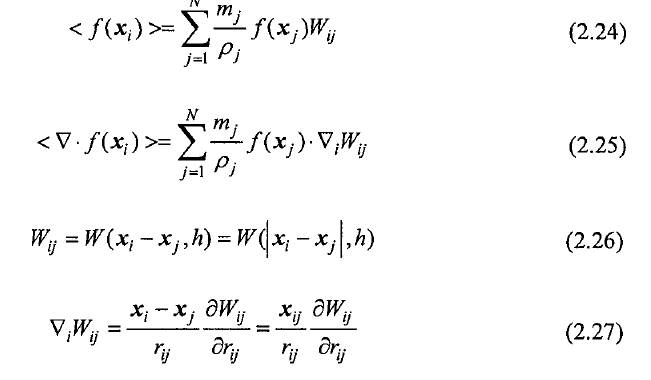

文档给的离散形式：

$$
\nabla f_i\approx-\sum_{j\neq i} V_j \nabla_i W_{ij} f_j
$$

现在我用一个实际的例子来看看它的正确性。假设一维空间的标量场是$f(x)=x$，并且$V_i=1$对所有粒子成立，那么$\nabla f=\mathrm{d}f/\mathrm{d}x=1$。那么我们需要验证的是：
$$
\left(\frac{\mathrm{d}f}{\mathrm{d}x}\right)_i
=1\approx-\sum_{j\neq i} x_j\nabla_i W_{ij}
=-\sum_{j\neq i} x_j\frac{x_i-x_j}{|x_i-x_j|}\frac{\partial W}{\partial r}
=-\sum_{j\neq i} x_j\operatorname{sign}(x_i-x_j)\frac{\partial W}{\partial r}.
$$
核函数$W(r)$显然随着$r$的增大而减小，因此$\partial W/\partial r < 0$。那么要使得文档的公式成立，必须满足：
$$
\sum_{j\neq i} x_j\operatorname{sign}(x_i-x_j) > 0.
$$
现在我们假设一维空间上有三个点，分别位于x=-1, x=0, x=1的位置。我们求x=0处的梯度，那么$x_i=0, x_j=-1或1$代入上式：
$$
-1\times\operatorname{sign}(0-(-1))+1\times\operatorname{sign}(0-1)=-1-1=-2 < 0
$$
所以文档给的离散公式是错误的。

或者$\nabla_i W_{ij}$应该改成$\nabla_j W_{ij}$

SPHinXsys源代码的公式**与代码的公式是反的**

`BaseNeighborBuilderContactFromShell::update_neighbors`
$$
e_{ij}=\frac{r_i-r_j}{r_{ij}+\varepsilon}
$$
`LinearGradient<Inner<DataType, Parameters...>>::InteractKernel::interact`
$$
\mathbf{G}_{ij} = dW_{ij}\,V_j\,\mathbf{B}_i\,\mathbf{e}_{ij}
$$

$$
\nabla \phi_i \approx \sum_{j\in\mathcal N(i)} (\phi_j-\phi_i)\,\mathbf{G}_{ij}
$$

Liu & Liu：

$$
f_i\nabla 1+\nabla f_i=-f_i\sum_j V_j \nabla_i W_{ij}-\sum_j V_j \nabla_i W_{ij} f_j=-\sum_{j\neq i} V_j \nabla_i W_{ij} (f_i+f_j)
$$

$$
\nabla f_i=\sum_j (f_j-f_i)\frac{\partial W}{\partial r}\bigg |_{r=r_j}\mathbf{e}_{ij} V_j
$$

